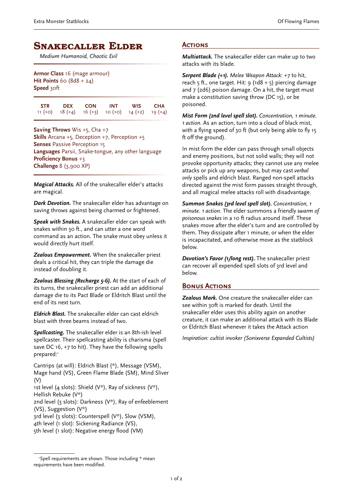

# dndstatblock

A template for writing statblocks (and only statblocks), in a simple style that imitates the 5e theme. It is intended to be fairly barebones and provide only formatting options, not dictate too much content.

It uses a two-column layout using open source versions of DnD fonts, as well as a traditional style Chinese font for CJK.

## Usage

This template can be initialised by calling
```
typst init @preview/dndstatblock:0.1.0
```
This will copy over all required fonts and comes prefilled with a statblock so you can see how it goes together. To use this you need to either install all the fonts locally or pass the folder into `--font-path` when compiling.

## Configuration

This template uses the `conf` function with the following named arguments:

- `header_left : content` the left hand side header
- `header_right : content` the right hand side header
- `footertext : content` the footer text (centred)

All other styling is set since this is trying to imitate a style (but feel free to copy and edit the package typ file if you need it different). An example is shown:

```typ
#import "@preview/dndstatblock:0.1.0": *

#show: conf.with(
  header_left: "Typst Monster statblocks", 
  header_right: "Sample document", 
  footertext: [--Yanwenyuan--]
)
```

## Other Functions

**dice**`(value:str)` parses a dice string (e.g. `3d6` or `3d6+2` or `3d6-1`) and returns a formatted dice value (e.g. "10 (3d6)"). Specifically, the types of string it accepts are:

> `\d+d\d+([+-]\d+)?` (number `d` number `+/-` number)

(You need to make sure the string is correct)

**diceRaw**`(numDice:int, diceFace:int, modifier:int)` is a helper function of the above and can optionally be used -- it takes all values as integer values and prints the correct formatting.

**statheading**`(title, desc = [])` takes a title and description, and formats it into a top-level monster name heading. `desc` is the description of the monster, e.g. *Medium humanoid, neutral evil* but can be anything. 

**stroke**`()` draws a red stroke with a fading right edge.


**mainstats**`(ac = "", hp_dice = "", speed = "30ft", hp_etc = "")` produces the **Armor Class**, **Hit Points**, **Speed** in one go. All fields are optional. `hp_dice` takes a *valid dice string only* -- if you do not want to use dice leave it blank and use `hp_etc`. No restrictions on other fields.


**ability**(str, dex, con, int, wis, cha)` Takes the six ability scores (base value) as integers and formats it into a table with appropriate modifiers.


**challenge**(cr:str)` takes a numeric challenge (as a string) rating and formats it along with the XP (if the challenge rating is valid). All CRs between 0-30 are valid, along with the fractional `1/8`, `1/4`, `1/2` (which can be written in decimal form too, e.g. `0.125`).


**skill**(title, contents)` takes a title and description, and is a single skills entry. For example, `#skill("Challenge", challenge(1))` will produce (in red)

> **Challenge** 1 (200 XP)

(This uses `challenge` from above)

**Section headers** such as *Actions* or *Reactions* are done using the second-level header `==`

**Action names** -- the names that go in front of actions / abilities are done using the third level header `===` (do not leave a blank line between the header and its body text) 

## Sample Statblock

This is the statblock shown in the preview. A much simpler statblock is provided in the template.



## Acknowledgments

- The overall style is based on the [Dnd 5e LaTeX Template](https://github.com/rpgtex/DND-5e-LaTeX-Template)'s statblocks, which in turn replicate the base DnD aesthetic.
- TeX Gyre Bonum by GUST e-Foundry is used for the main title
- Scaly Sans and Scaly Sans Caps are part of [Solbera's CC Alternatives to DnD Fonts](https://github.com/jonathonf/solbera-dnd-fonts) and are used for main body text. ***Note that these fonts are CC-BY-SA i.e. Share-Alike, so keep that in mind. This shouldn't affect homebrew created using these fonts (just like how a painting made with a CC-BY-SA art program isn't itself CC-BY-SA) but what do I know I'm not a lawyer.***
- [KingHwa_OldSong](https://zhuanlan.zhihu.com/p/637491623) (京華老宋体) is a traditional Chinese print font used for all CJK text (if present, mostly because I need it)


